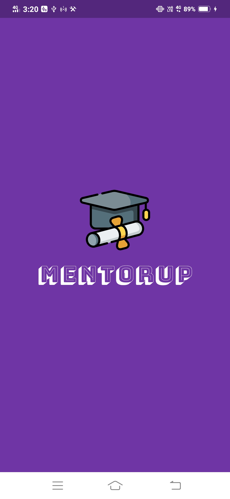

# Mentorup App 🧑‍🏫 

## <a name="system">About the app</a>

**Startup Mentoring App** is an app created to help the startups initiated by the budding entrepreneurs to get guidance from the mentors and financial support from the funders by communicating thorugh chatpage. Other features include updates on lastest news related to startups, webinars, blogs and forums to discuss. This app is developed using Flutter/Dart and used Aqueduct as backend server.

You can check the web version of this same system [here](https://github.com/ekta18/Startup-Mentoring-Website).

---

## <a name="ss">Screenshots</a>

<table>
    <tr>
        <th align="center">App Logo</th>
        <th align="center">Splash Screen</th>
        <th align="center">Welcome Screen</th>
    </tr>
    <tr>
        <td align="center">
            
        </td>
        <td align="center">
            
        </td>
        <td align="center">
            
        </td>
    </tr>
</table>

